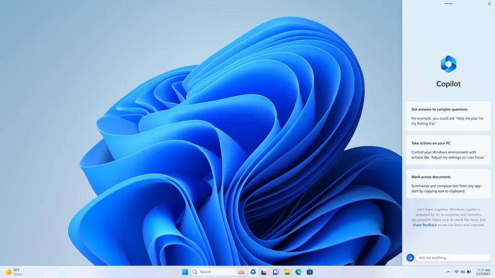
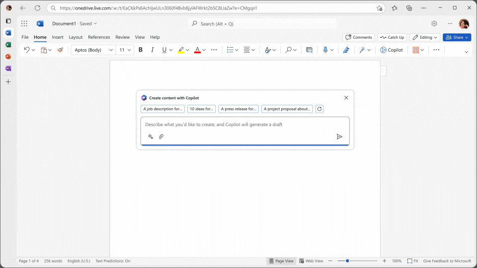
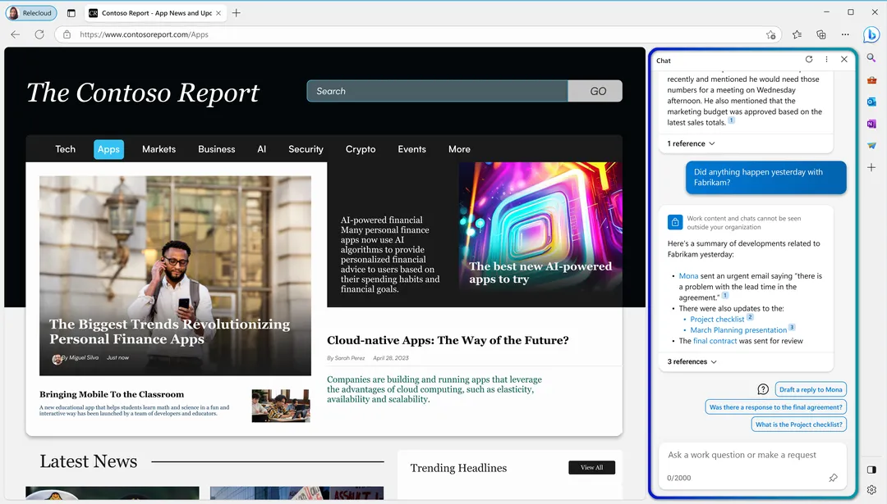
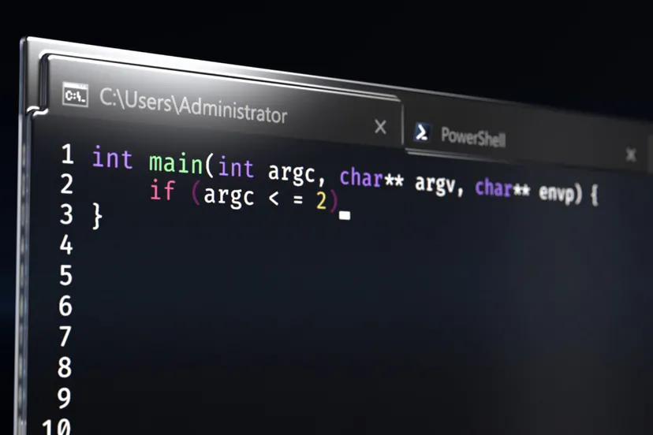
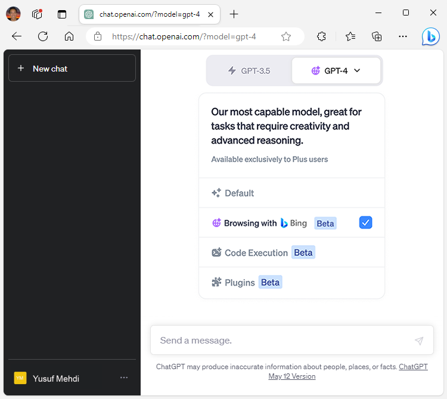

The 2023 Microsoft Build event focused heavily on AI advancements across several Microsoft products, including Windows 11, Microsoft 365, and Bing. Here are the highlights:

1. **Windows 11**: Microsoft is introducing an AI personal assistant called Copilot to Windows 11. This assistant is already integrated across Edge, Office apps, and GitHub, but on Windows 11, it will live within the taskbar. From the Copilot sidebar, you can ask it to summarize, rewrite, and explain text in any apps you're using, and adjust your computer's settings. This feature is planned for public testing next month. Other updates to Windows 11 include support for Bluetooth LE, 10 new languages and dialects for live captions, and native RGB controls​​.

2. **Microsoft 365 Copilot**: Microsoft 365 Copilot now supports plug-ins, including Teams messages extensions, Power Platform connectors, and tools using technology from ChatGPT. It will also support third-party plug-ins like those from Atlassian and Adobe. Microsoft will build all its Copilot and Bing Chat plug-ins using the same standard as OpenAI uses for ChatGPT, making it easier for developers to create them and allowing the same plug-ins to be used across all three AI-powered tools​.

3. **Microsoft Edge**: Microsoft Edge will soon integrate with 365 Copilot. This tool will live within the browser's sidebar and use the content on the site you're viewing to help you work on projects in Microsoft 365 apps. It should assist with tasks like drafting emails, adding data to spreadsheets, generating status updates based on chat threads, and more. This integration will also support the newly announced plug-ins for 365 Copilot​​.

4. **Windows Terminal**: Windows Terminal is getting an AI-powered chatbot through an integration with GitHub Copilot. Developers using GitHub Copilot can use the chatbot directly within Terminal for actions, code recommendations, and error explanations. Microsoft also announced a new Dev Home dashboard for easier setup and use of Windows dev machines, AI-generated app review summaries for the Microsoft Store, and a new AI Hub to highlight Windows apps that utilize AI​​.

5. **Bing and ChatGPT**: Bing has become the default search engine for OpenAI's ChatGPT chatbot. Starting today, ChatGPT Plus users will start seeing citations surfaced by Bing appended to the chatbot’s responses. Bing will soon support plug-ins from Expedia, Instacart, Kayak, Klarna, Redfin, TripAdvisor, Zillow, and more​​.
